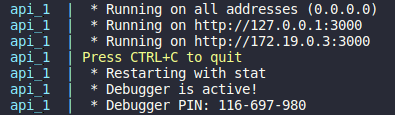

# logistic-app-backend
A simple Python Flask API that lists information about orders from a PostgreSQL database using pagination.


## Technologies

  - Python 3.10
  - Flask
  - PostgreSQL
  - Docker
  - docker-compose

## How to set up

  ### Setting environment variables

  - Firstly, make a copy of the .env.example file and rename it to ".env".
  - Fill in the values ​​in the file according to your preference and database settings. Example:
    ```python
    DEBUG=True
    PORT=5000
    POSTGRES_USER=test
    POSTGRES_PASSWORD=test
    POSTGRES_DB=test
    POSTGRES_HOST=db
    POSTGRES_PORT=5432
    ``` 
  - In the next step, we will learn how to run the API.

  ### Running with docker-compose (recommended)

  You need to have Docker and docker-compose installed.

  - Inside of the project root directory, execute the command:

    ```bash
      docker-compose up
    ```

  - Docker-compose will install the dependencies and run the scripts to initialize and populate the database. 
  
    When you see an output like this:

    

    The API is running and you can use it! That's all!!

  ### Running manually

  - Inside of the project root directory, execute this command to create your virtual environment (optional):

    ```
    # Creating your virtual env (opcional)
    $ python -m venv venv

      # Activating (Linux)
      $ source venv/bin/activate

      # Activating (Windows)
      $ venv\Scripts\activate  
    ```
    
  - Install the dependencies:
    ```bash
      pip install -r requirements.txt
    ```

  - Execute the following commands to go to the settings directory, initialize and populate the database:
    ```bash
      cd app/settings/ && python run_db_migration.py database_init.sql && python run_db_seed.py
    ```
  - Finally, go to the project root directory and execute the following command to run the API:
    ```bash
      cd ../../ && python run.py
    ```
  - When you see an output like this:

    

    The API is running and you can use it! That's all!!

## Endpoints

  ### /orders (GET)
  **Description:** 
  Lists all orders. 
  Accepts search, date range filter and pagination parameters.

  **Request example:**
  ```
  GET /orders?page=1&limit=1&search=003&date=2020-01-04T05:34:12,2020-01-06T05:34:12
  ```
  **Response example:**
  ```json
  {
    "data": [
      {
        "created_at": "2020-01-05T05:34:12",
        "customer": {
          "company": {
            "id": 1,
            "name": "Roga & Kopyta"
          },
          "credit_cards": "[\"*****-1234\", \"*****-5678\"]",
          "id": "ivan",
          "login": "ivan",
          "name": "Ivan Ivanovich",
          "password": "12345"
        },
        "id": 3,
        "items": [
          {
            "deliveries": [
              {
                "delivered_quantity": 12,
                "id": 3
              }
            ],
            "id": 3,
            "price_per_unit": 123.0345,
            "product": "Corrugated Box",
            "quantity": 12
          },
          {
            "deliveries": [
              
            ],
            "id": 13,
            "price_per_unit": 273.1234,
            "product": "Hand sanitiZER",
            "quantity": 22
          }
        ],
        "name": "PO #003-I"
      }
    ],
    "total": 10
  }
  ```
